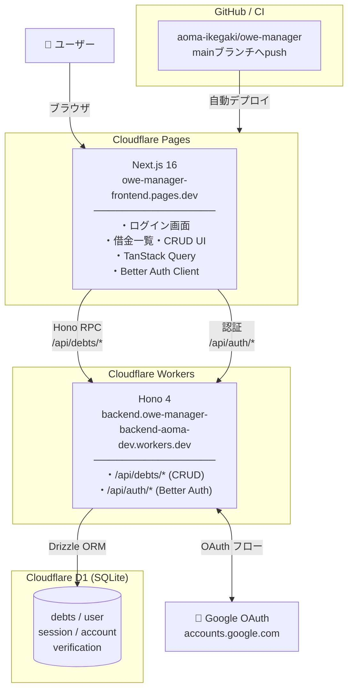
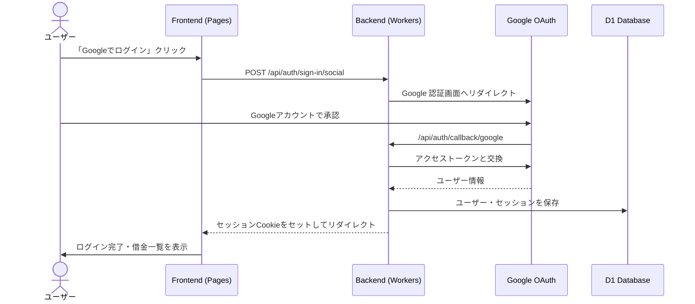

# owe-manager(開発中)

🌐 **本番URL**: https://owe-manager-frontend.pages.dev

「誰に、いくら、いつまでに」返すべきかを明確にし、返済漏れを防ぐための個人向け債務管理アプリケーションです。

## 技術スタック
| カテゴリ | 技術 |
| :--- | :--- |
| Frontend | Next.js (App Router), TanStack Query, Zod, Tailwind CSS, Sonner |
| Backend | Hono, Hono RPC, Cloudflare Workers |
| Database | Cloudflare D1(SQLite), Drizzle ORM, Cloudflare Pages |

## 主な機能
- 借金の表示、登録、編集、削除（CRUD）
- 返済状況のステータス更新
- 現在の合計借金額の表示
- 未返済/返済済みの一覧表示

## ディレクトリ構成
owe-manager/
├── frontend/          # Next.js アプリ（Cloudflare Pages）
│   ├── app/
│   │   └── page.tsx   # メイン画面（ログイン・借金一覧）
│   ├── lib/
│   │   ├── api.ts          # Hono RPC クライアント
│   │   └── auth-client.ts  # Better Auth クライアント
│   └── next.config.ts
│
├── backend/           # Hono API（Cloudflare Workers）
│   ├── src/
│   │   ├── index.ts        # APIルート定義
│   │   ├── lib/auth.ts     # Better Auth 設定
│   │   └── db/schema.ts    # Drizzle ORM スキーマ
│   ├── migrations/         # D1 マイグレーションSQL
│   └── wrangler.jsonc      # Cloudflare Workers 設定
│
└── shared/            # フロントエンド・バックエンド共通
    └── schemas.ts     # Zod バリデーションスキーマ

## システム構成図

## 認証フロー

